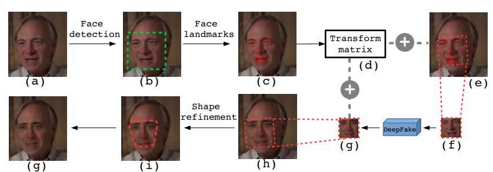
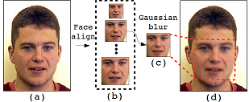

## Exposing DeepFake Videos By Detecting Face Warping Artifacts
Yuezun Li and Siwei Lyu \
University at Albany, State University of New York, USA \
IEEE Conference on Computer Vision and Pattern Recognition Workshops (CVPRW), 2019 \
[https://arxiv.org/abs/1811.00656](https://arxiv.org/abs/1811.00656)

### Contents
1. [Overview](#Overview)
2. [Requirements](#Requirements)
3. [Usage](#Usage)
4. [Train](#Train)


### Overview


Our method is based on the observations that current DeepFake algorithm can only generate images of limited resolutions, which need to be further warped to match the original faces in the source video. Such transforms leave distinctive artifacts in the resulting DeepFake videos, see the figure above.
Our method detects such artifacts by comparing the generated face areas and their surrounding regions with a dedicated Convolutional Neural Network (CNN) model.  

#### Negative Samples


To train the CNN model, we simplify the process by simulating the resolution inconsistency in affine face warpings directly. 
Specifically, we first detect faces and then extract landmarks to compute the transform matrices to align the faces to a standard configuration. We apply Gaussian blurring to the aligned face, which is then affine warped back to original image using the inverse of the estimated transformation matrix, see the figure above

### Requirements
- Tensorflow 1.3.0
- Ubuntu 16.04
- CUDA 8.0
- Python 2.7 with following packages
    ```
    yaml==3.12
    easydict==1.7
    matplotlib==1.5.3
    dlib==19.16.0
    opencv==3.4.0
    ```

### Usage
1. The trained models can be download in [resolution-net-models](https://1drv.ms/u/s!As4tun0sWfKsgdJFVA9qdnRmqKbfpg?e=4Hrvf6). Unzip and put model files into 
folder `ckpt_NETNAME`.
2. The testing data (images or videos) is put in folder `folder/of/test_data`. Then 
run `demo.py` which will return a list that contains the "fake" probability of each input data. 
If there is no face existed in input data, 0 is returned.

        python demo.py --input_dir=folder/of/test_data
        
    
### Train Data preparation
Face images for training can be downloaded from the public dataset. I put several links here.
    
    http://web.mit.edu/emeyers/www/face_databases.html
    http://biometrics.put.poznan.pl/put-face-database/
    https://github.com/StephenMilborrow/muct
    http://www2.ece.ohio-state.edu/~aleix/ARdatabase.html
    http://pics.psych.stir.ac.uk/2D_face_sets.htm

The data download from these datset are positive samples. 
Since we focus on the artifacts introduced in the inconsistency of resolution between face area and surrounding area,
the negative samples do not have to be DeepFake generated images. Thus the negative samples for our training can 
be easily created. Please check paper for more details.

    
### Citation

Please cite our paper in your publications if it helps your research:

    @inproceedings{li2019exposing,
      title={Exposing DeepFake Videos By Detecting Face Warping Artifacts},
      author={Li, Yuezun and Lyu, Siwei},
      booktitle={IEEE Conference on Computer Vision and Pattern Recognition Workshops (CVPRW)},
      year={2019}
    }
    
#### Notice
This repository is NOT for commecial use. It is provided "as it is" and we are not responsible for any subsequence of using this code.


